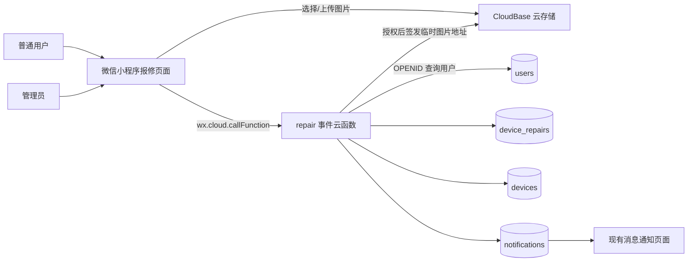
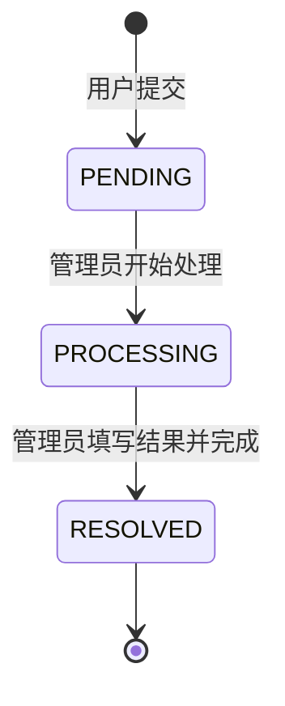

# 设备报修功能技术设计

## 1. 设计目标

在不改变现有预约、设备状态和禁用时段规则的前提下，新增一条独立的设备报修闭环：用户提交图文故障信息，管理员接收站内通知并处理，用户查看处理进度与结果。

设计优先保证三点：调用者身份可信、图片与报修记录访问受控、报修状态和通知在并发操作下保持一致。

## 2. 总体架构



### 2.1 模块边界

- `miniprogram/pages/repair/create`：选择设备、填写故障、选择和上传照片、提交报修。
- `miniprogram/pages/repair/mine`：展示当前用户自己的报修记录。
- `miniprogram/pages/repair/detail`：用户和管理员共用的报修详情；服务端根据身份决定可见数据和管理员操作权限。
- `miniprogram/pages/admin/repairs`：管理员报修总览、状态筛选和待处理数量。
- `cloudfunctions/repair`：所有报修读写、权限校验、状态流转、图片临时地址和通知编排。
- `cloudfunctions/admin`：仅扩展管理首页汇总，返回待处理报修数量。
- `cloudfunctions/notification`：识别报修通知类型并安全返回导航信息；不承载报修业务写入。

报修功能使用新的 Event Function，调用方式为 `wx.cloud.callFunction`，运行时与当前项目保持一致，使用 `Nodejs16.13` 和 `wx-server-sdk`。本功能不需要 HTTP 网关或公开接口。

## 3. 页面与交互设计

### 3.1 视觉规范

- 方向：工业 / 实用型，延续现有实验室小程序的深绿品牌风格。
- 主色：`#174A3C`、操作色 `#176B5B`、浅底色 `#E8F2EF`、页面底色 `#F7F8FA`、异常色 `#B64A43`。
- 字体：中文沿用 `PingFang SC`，编号、英文辅助信息和状态标识沿用 `Georgia`。
- 布局：用左侧状态轨、分段编号和错位信息块形成层级；避免新增居中弹卡和大面积阴影。
- 图标：优先复用项目既有字符/线性图形语言；若新增图标，使用一致的本地 SVG 资源，不使用 Emoji。

### 3.2 用户入口

- 设备详情页在主操作区增加次级按钮“设备报修”，不抢占“预约此设备”的主操作层级。
- 设备列表页标题区增加轻量入口“我的报修”，避免改动用户刚确认的“我的”页面消息卡片位置。
- 从设备详情进入时携带 `deviceId` 并锁定显示该设备；从“我的报修”进入后可点击“新增报修”，再从可用设备列表中选择设备。

### 3.3 提交页

页面按以下顺序展示：

1. `01 选择设备`：设备详情入口自动带入；其他入口使用选择器展示设备编号和名称。
2. `02 故障描述`：多行输入，显示 `当前字数 / 500`，不足 10 字时不允许提交。
3. `03 现场照片`：三列图片区，支持 1–3 张、预览、删除和重新选择。
4. 底部固定主按钮“提交报修”，上传或提交期间显示明确加载状态并防止重复点击。

照片选择使用 `wx.chooseMedia`，限制为图片、最多 3 张；单张图片建议限制为 10 MB。上传失败时保留设备、描述和未失败的本地图片，不清空表单。

### 3.4 用户记录与详情

- “我的报修”按创建时间倒序分页展示设备名称、设备编号、故障摘要、状态和提交时间。
- 状态视觉：待处理为告警色轨、处理中为深绿色轨、已完成为灰绿色轨。
- 详情页展示设备快照、完整描述、图片宫格和时间线。
- 已完成记录额外展示处理结果、处理人和完成时间。

### 3.5 管理员页面

- 管理首页新增“设备报修”入口；入口及概览区展示 `PENDING` 数量。
- 管理列表支持 `全部 / 待处理 / 处理中 / 已完成` 筛选，默认“待处理”。
- 列表项展示设备、报修人、学号、提交时间、故障摘要和状态。
- 点击列表项进入共用详情页。`PENDING` 显示“开始处理”，`PROCESSING` 显示处理结果输入框和“完成处理”，`RESOLVED` 只读。
- “完成处理”前要求填写 2–500 字处理结果，并弹出二次确认。

## 4. 数据模型

### 4.1 `device_repairs`

```js
{
  _id: "repair_<随机安全标识>",
  deviceId: "设备文档 ID",
  deviceName: "提交时的设备名称快照",
  deviceNo: "提交时的设备编号快照",
  deviceLocation: "提交时的位置快照",

  reporterUserId: "users._id",
  reporterName: "提交时的姓名快照",
  reporterStudentNo: "提交时的学号快照",

  description: "10–500 字故障描述",
  photoFileIds: ["cloud://..."],
  status: "PENDING | PROCESSING | RESOLVED",
  version: 1,

  processingBy: null,
  processingByName: "",
  processingAt: null,

  resolution: "",
  resolvedBy: null,
  resolvedByName: "",
  resolvedAt: null,

  createdAt: ServerDate,
  updatedAt: ServerDate
}
```

设备和用户均保存快照，设备或用户资料之后发生修改时，历史报修仍能完整展示。报修记录不会阻止设备删除；提交时必须确认设备仍存在。

### 4.2 索引

- `reporterUserId ASC, createdAt DESC`：用户自己的报修列表。
- `status ASC, createdAt DESC`：管理员按状态筛选。
- `createdAt DESC`：管理员全部记录。
- `deviceId ASC, createdAt DESC`：后续设备历史查询预留。

集合权限设为 `ADMINONLY`，小程序端不直接查询或修改集合。

### 4.3 云存储

- 目录格式：`device-repairs/<年月>/<随机草稿标识>/<序号>.<白名单扩展名>`。
- 草稿标识由安全随机值和时间组成，不拼接设备名、姓名、学号、描述等用户输入。
- 数据库只保存 CloudBase 文件 ID，不持久化临时 URL。
- 详情接口通过权限校验后调用云存储临时地址能力，将短期可访问 URL 返回给当前页面。
- 如果上传成功但创建报修失败，小程序端对本次新上传文件执行尽力清理；清理失败不掩盖原始提交错误。

## 5. 云函数接口

所有接口均从 `cloud.getWXContext().OPENID` 获取身份，再查询 `users`。客户端传入的 userId、姓名、角色或状态一律不作为授权依据。

| action | 调用者 | 入参 | 返回 | 说明 |
| --- | --- | --- | --- | --- |
| `create` | 已通过用户 | `deviceId, description, photoFileIds` | `{ id }` | 服务端读取设备、用户快照并创建 `PENDING` 记录 |
| `mine` | 已通过用户 | `page, pageSize` | 分页列表 | 仅返回 `reporterUserId === 当前用户._id` |
| `detail` | 本人或管理员 | `id` | 详情、临时图片地址、允许操作 | 先鉴权再签发图片地址 |
| `adminList` | 管理员 | `status, page, pageSize` | 分页列表和状态计数 | 状态白名单校验 |
| `startProcessing` | 管理员 | `id` | 更新后的状态 | 仅允许 `PENDING → PROCESSING` |
| `resolve` | 管理员 | `id, resolution` | 更新后的状态 | 仅允许 `PROCESSING → RESOLVED` |

### 5.1 输入校验

- `deviceId`、报修 ID 必须为非空安全字符串，并限制长度。
- 描述去除首尾空白后必须为 10–500 字。
- 处理结果去除首尾空白后必须为 2–500 字。
- 图片必须为 1–3 个不重复的 `cloud://` 文件 ID，且路径必须位于 `device-repairs/` 目录。
- 页码最小为 1，单页默认 20、最大 50。
- 状态仅接受 `ALL / PENDING / PROCESSING / RESOLVED`。
- 不返回 OPENID、环境变量、原始 `event`、`context` 或其他运行时敏感信息。

### 5.2 状态机与并发



- `startProcessing` 与 `resolve` 均在事务中重新读取报修文档并校验当前状态。
- 每次合法流转递增 `version`，避免页面旧状态覆盖新状态。
- 重复开始、越级完成或已完成后再次提交均返回业务错误，不执行写入。

## 6. 通知设计

新增通知类型：

- `DEVICE_REPAIR_CREATED`：发给全部已通过管理员。
- `DEVICE_REPAIR_PROCESSING`：发给报修用户。
- `DEVICE_REPAIR_RESOLVED`：发给报修用户。

通知导航统一使用：

```js
{
  businessType: "DEVICE_REPAIR",
  businessId: repairId,
  navigation: { page: "DEVICE_REPAIR_DETAIL", params: { id: repairId } }
}
```

消息页面只将该受控页面标识映射到 `/pages/repair/detail?id=...`，不接受通知文档中的任意 URL。

通知使用确定性文档 ID：

- 新报修：`repair_created_<repairId>_<adminUserId>`
- 开始处理：`repair_processing_<repairId>`
- 完成处理：`repair_resolved_<repairId>`

创建或状态流转与对应通知在同一数据库事务内完成。接口重试时，固定通知 ID 不会生成重复记录。站内消息为本期可靠渠道，不新增微信订阅模板依赖。

## 7. 权限与安全

- 未注册、待审核、已拒绝或已禁用用户不能创建或查看报修。
- 管理员必须同时满足 `role === 'ADMIN'` 与 `status === 'APPROVED'`。
- 普通用户详情查询必须满足 `reporterUserId === 当前用户._id`。
- 管理列表与状态流转仅管理员可调用。
- 设备名称、编号、位置和报修人信息全部由服务端查询后写入，不信任客户端快照。
- 图片临时地址只在报修详情授权通过后生成；列表接口不返回图片访问地址。
- 云函数日志只记录报修 ID、动作和非敏感错误摘要，不记录 OPENID、完整描述、图片地址、原始事件或运行环境。
- `device_repairs` 在部署前显式创建并配置权限，不能依赖首次 `.add()` 自动创建。

## 8. 现有模块改动

- `miniprogram/app.json`：注册 4 个报修页面路由。
- `miniprogram/pages/device/detail.*`：增加“设备报修”次级入口。
- `miniprogram/pages/home/index.*`：增加“我的报修”轻量入口。
- `miniprogram/pages/admin/index.*`：增加报修入口和待处理数量。
- `miniprogram/pages/notifications/index.js`：增加报修类型标签和受控详情跳转。
- `cloudfunctions/admin/index.js`：`summary` 增加 `pendingRepairs`。
- `cloudfunctions/notification/index.js`：允许并标准化三类报修通知。
- `database/indexes.md`：登记 `device_repairs` 索引。
- 新增 `cloudfunctions/repair` 与报修页面文件。

不修改预约创建、签到签退、设备状态流转、设备禁用时段和微信模板配置逻辑。

## 9. 异常处理

- 图片选择失败：保留已有表单并提示用户重新选择。
- 部分图片上传失败：标记失败项，可重试；未全部成功时不调用 `create`。
- 报修创建失败：不跳转成功页，并尝试删除本轮已经上传的云文件。
- 临时图片地址生成失败：详情文字仍可展示，图片区域显示“图片暂时无法加载”并支持重试。
- 状态冲突：刷新详情并提示“报修状态已更新，请查看最新进度”。
- 通知事务失败：对应业务写入一起回滚，避免记录已变更但消息缺失。

## 10. 验证策略

### 10.1 云函数

- 未审核用户创建报修被拒绝。
- 描述 9/10/500/501 字和照片 0/1/3/4 张的边界测试。
- 不存在设备、非报修目录文件 ID、重复图片 ID被拒绝。
- 普通用户不能读取他人记录，管理员可以读取全部记录。
- 并发两次“开始处理”只有一次成功；不能从 `PENDING` 直接完成。
- 三类通知文档 ID固定，接口重试不产生重复消息。

### 10.2 小程序

- 从设备详情进入时正确带入设备；从通用入口进入时可选择设备。
- 选择、预览、删除 1–3 张照片并处理上传失败。
- 用户列表、详情、状态时间线和处理结果展示正确。
- 管理员筛选、开始处理、完成处理及输入校验正确。
- 消息通知可安全跳转到本人或管理员有权查看的报修详情。

### 10.3 发布前检查

- JavaScript 语法检查和小程序编译通过。
- 新集合、权限和复合索引已创建。
- `repair` 事件云函数部署后完成至少一次创建、一次本人查询、一次管理员流转的开发环境验证。
- 真机验证图片选择、上传、预览和临时地址加载；模拟器结果不能替代真机媒体权限验证。

## 11. 关键取舍

- **独立云函数而非继续扩展 `admin`/`device`**：报修包含用户端、管理员端、图片和状态机，独立边界可避免已有函数继续膨胀。
- **共用详情页而非用户/管理员各写一份**：减少展示逻辑重复，操作权限由服务端响应决定。
- **设备快照而非仅保存 deviceId**：设备后续改名或删除不会破坏历史记录。
- **临时图片地址而非永久公网地址**：数据库不暴露长期可访问链接，访问前必须经过业务授权。
- **站内通知先行**：复用现有可靠消息中心，不依赖尚未配置的真实微信订阅模板。
