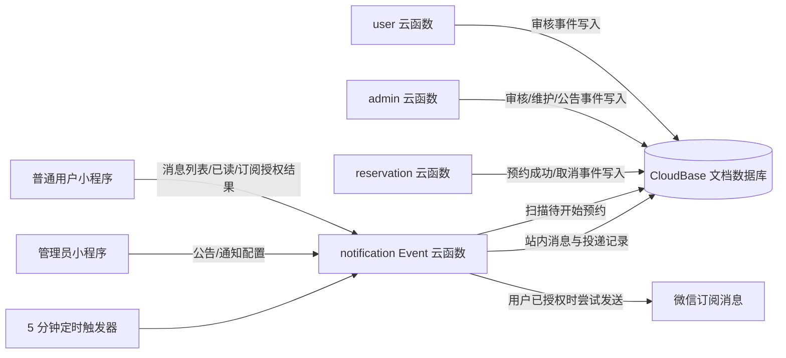

# 消息通知功能技术设计

## 1. 设计概述

本功能采用“站内消息为主、微信订阅消息为辅”的双通道架构。审核、预约和维护业务在成功后生成幂等站内消息；独立的 `notification` Event 云函数负责消息查询、已读管理、公告管理、订阅消息投递和定时提醒扫描。

核心原则：

- 核心业务优先：通知投递失败不得回滚审核、预约、取消、维护或公告操作。
- 站内消息可靠：任何需要通知的业务事件至少留下站内消息。
- 微信推送尽力而为：只有用户授权且模板配置有效时才发送。
- 服务端可信：接收人、消息类型、业务内容和跳转目标均由服务端生成。
- 幂等优先：业务通知使用确定性消息 ID，定时任务重跑不重复生成。

## 2. 架构与模块边界



### 2.1 现有云函数调整

- `user`
  - 注册或重新提交审核时维护 `reviewVersion`。
  - 不直接发送通知；审核结果由 `admin.reviewUser` 生成。
- `admin`
  - 审核用户时，在同一事务内更新审核结果并生成审核通知。
  - 设备从其他状态切换为 `MAINTENANCE` 时，为该设备未来有效预约用户生成维护提示。
  - 现有预约规则增加 `reminderMinutes`，仅允许 15 或 30。
- `reservation`
  - 创建预约、代预约、用户取消和管理员取消时，在事务内生成对应通知。
  - 签到后预约变为 `IN_USE`，定时任务不会再发送开始提醒。

### 2.2 新增 `notification` Event 云函数

- 普通用户：未读汇总、分页列表、标记已读、全部已读、记录最近一次订阅授权结果。
- 管理员：公告列表、发布、停用、通知配置读取与保存。
- 定时任务：每 5 分钟扫描提醒窗口，创建提醒消息并尝试投递。
- 投递任务：读取服务端模板配置，构造微信订阅消息并记录结果。

该函数不新增 HTTP 公网入口，继续通过 `wx.cloud.callFunction` 和定时触发器运行。

## 3. 数据模型

### 3.1 `notifications` 定向站内消息

```json
{
  "_id": "reservation_created_<reservationId>",
  "recipientUserId": "用户文档ID",
  "type": "REVIEW_RESULT | RESERVATION_CREATED | RESERVATION_CANCELLED | RESERVATION_REMINDER | DEVICE_MAINTENANCE",
  "title": "预约成功",
  "content": "高温万能试验机，2026-08-28 09:00–11:00",
  "businessType": "USER | RESERVATION | DEVICE",
  "businessId": "关联业务ID",
  "navigation": {
    "page": "MINE_RESERVATION | PROFILE_STATUS | DEVICE_DETAIL",
    "params": { "id": "关联ID" }
  },
  "readAt": null,
  "createdAt": "serverDate",
  "updatedAt": "serverDate"
}
```

约束：

- `_id` 使用服务端生成的确定性 ID，天然实现一次业务事件一次消息。
- 客户端不传入 `recipientUserId`、`type`、`navigation` 或消息正文。
- 普通用户查询必须同时限制 `recipientUserId = 当前用户ID`。

### 3.2 `announcements` 系统公告

```json
{
  "title": "实验室开放时间调整",
  "content": "公告正文",
  "status": "PUBLISHED | DISABLED",
  "startsAt": 0,
  "endsAt": 0,
  "pushWechat": false,
  "publishedBy": "管理员用户ID",
  "publishedAt": "serverDate",
  "disabledBy": null,
  "disabledAt": null,
  "createdAt": "serverDate",
  "updatedAt": "serverDate"
}
```

站内公告不向每个用户复制一份消息；消息中心动态合并当前有效公告，避免用户数量增长时产生大规模写入。

### 3.3 `announcement_reads` 公告已读记录

```json
{
  "_id": "<announcementId>_<userId>",
  "announcementId": "公告ID",
  "userId": "用户ID",
  "readAt": "serverDate"
}
```

确定性 `_id` 保证重复打开公告时只保留一条已读记录。

### 3.4 `notification_deliveries` 微信投递记录

```json
{
  "_id": "<notificationId>_wechat",
  "notificationId": "站内消息ID或公告ID",
  "recipientUserId": "用户ID",
  "channel": "WECHAT_SUBSCRIBE",
  "templateKey": "review | reservationCreated | reservationCancelled | reminder | maintenance | announcement",
  "status": "PENDING | SENT | FAILED | SKIPPED",
  "resultCode": "脱敏后的微信返回码",
  "resultMessage": "截断后的非敏感说明",
  "attemptedAt": "serverDate",
  "createdAt": "serverDate",
  "updatedAt": "serverDate"
}
```

失败默认不自动无限重试。网络或平台临时错误最多重试一次；授权拒绝、模板无效等确定性错误直接记为 `FAILED` 或 `SKIPPED`。

### 3.5 `notification_preferences` 授权结果快照

```json
{
  "_id": "用户ID",
  "userId": "用户ID",
  "templateResults": {
    "模板ID": "accept | reject | ban"
  },
  "updatedAt": "serverDate"
}
```

该记录仅用于界面提示与运营排查，不作为永久授权证明；实际发送结果以微信接口返回为准。

### 3.6 `settings/notification` 通知配置

```json
{
  "reminderMinutes": 30,
  "announcementWechatEnabled": false,
  "templates": {
    "review": { "templateId": "", "fields": {} },
    "reservationCreated": { "templateId": "", "fields": {} },
    "reservationCancelled": { "templateId": "", "fields": {} },
    "reminder": { "templateId": "", "fields": {} },
    "maintenance": { "templateId": "", "fields": {} },
    "announcement": { "templateId": "", "fields": {} }
  },
  "updatedBy": "管理员用户ID",
  "updatedAt": "serverDate"
}
```

模板 ID 不是密钥，但仅通过管理员接口读取和修改；普通用户只得到可请求授权的有效模板 ID 列表，不得到内部字段映射。

## 4. 幂等与一致性

### 4.1 确定性消息 ID

| 事件 | 消息 ID |
|---|---|
| 审核结果 | `review_<userId>_<reviewVersion>` |
| 预约成功 | `reservation_created_<reservationId>` |
| 预约取消 | `reservation_cancelled_<reservationId>` |
| 开始提醒 | `reservation_reminder_<reservationId>_<startAt>_<minutes>` |
| 设备维护 | `device_maintenance_<deviceId>_<maintenanceVersion>_<userId>` |

重复 `set` 仅更新同一消息，不新增重复记录。发送记录同样使用确定性 ID。

### 4.2 事务边界

- 审核结果、预约创建和预约取消：业务状态更新与站内消息写入同一数据库事务。
- 微信订阅消息：事务提交后尝试发送；发送失败只更新投递记录。
- 系统公告：公告文档写入成功即视为发布成功，微信推送异步执行。
- 定时提醒：先以确定性 ID 创建站内消息，再判断是否需要微信投递。

## 5. 定时提醒设计

- 新增 `notification` Event 云函数的 timer 触发器。
- Cron：`0 */5 * * * * *`，每 5 分钟执行一次。
- 每次读取 `settings/notification.reminderMinutes`，默认 30。
- 扫描 `BOOKED` 且 `startAt` 落在“当前时间 + 提前量”附近的预约。
- 为避免定时漂移，扫描窗口覆盖最近 5 分钟并依赖确定性消息 ID 去重。
- 已取消、已签到、已结束预约不进入提醒集合。
- 分页处理并限制单次批量，避免函数超时；剩余数据由下一次触发继续处理。

推荐查询索引：

- `reservations`: `status asc, startAt asc`（项目现有 `status_start` 可复用）
- `notifications`: `recipientUserId asc, createdAt desc`
- `announcements`: `status asc, startsAt asc, endsAt asc`
- `notification_deliveries`: `status asc, createdAt asc`

## 6. 微信订阅消息设计

### 6.1 授权入口

- 注册页：用户点击“提交审核”时，可在业务提交前请求审核结果模板授权。
- 预约页：用户点击“确认预约”时，可请求预约成功、取消和开始提醒相关模板授权。
- 消息中心：提供“开启微信提醒”按钮，由用户主动触发授权。
- 页面加载时不得自动弹出授权窗口。

授权拒绝、关闭或接口失败时继续原业务流程。

### 6.2 服务端发送

- `notification` 云函数通过 `wx-server-sdk` 的微信开放接口发送订阅消息。
- `touser` 只从服务端用户文档的 `openid` 获取。
- 模板 ID 与字段映射从 `settings/notification` 读取。
- 消息字段统一做长度限制、日期格式化和空值替换。
- 不记录或返回运行环境、上下文、请求头或任何凭据。

### 6.3 模板适配

微信公众平台实际选用模板的字段名可能不同，因此采用“语义字段 → 实际模板字段”的服务端映射。管理员保存配置时校验模板 ID 和字段名称格式；正式联调时按已选模板逐项验证。

## 7. API 设计

### 7.1 普通用户接口（`notification`）

| action | 用途 | 关键返回/约束 |
|---|---|---|
| `summary` | 未读数量和模板可用状态 | 仅当前用户 |
| `list` | 分页查询定向消息与有效公告 | 时间倒序，最多 20 条/页 |
| `markRead` | 标记单条消息或公告已读 | 校验消息归属 |
| `markAllRead` | 全部标为已读 | 仅当前用户可见范围 |
| `subscriptionTemplates` | 返回可申请授权的模板 ID | 不返回字段映射 |
| `saveSubscriptionResult` | 保存客户端授权结果快照 | 仅允许固定状态值 |

### 7.2 管理员接口（`notification`）

| action | 用途 | 关键约束 |
|---|---|---|
| `adminListAnnouncements` | 公告列表 | 管理员权限 |
| `adminPublishAnnouncement` | 发布公告 | 标题、正文、有效期校验 |
| `adminDisableAnnouncement` | 停用公告 | 记录管理员和时间 |
| `adminGetSettings` | 读取通知配置 | 管理员权限 |
| `adminSaveSettings` | 保存提醒时间和模板映射 | 提醒时间仅 15/30 |

定时触发路径不接受客户端指定接收人、模板内容或消息正文。

## 8. 设备维护通知的兼容处理

当前系统创建 `device_blocks` 时会阻止与有效预约冲突，因此“成功新增禁用时段”通常不存在受影响预约用户。为保持现有冲突安全规则，本期采用：

1. 设备状态由 `AVAILABLE` 切换为 `MAINTENANCE` 时，自动通知该设备未来有效预约用户。
2. 管理员因维护取消预约时，复用预约取消通知并附维护原因。
3. 新增无冲突的维护/禁用时段时不发送空通知。
4. 不自动取消预约，也不放宽现有禁用时段冲突校验。

该处理是对需求 R5 的技术细化，避免维护通知功能隐式改变预约数据。

## 9. UI 设计规格

### DESIGN SPECIFICATION

1. **Purpose Statement**：为实验室成员提供低干扰、可追溯的消息入口，使关键审核与预约变化能被快速识别；同时让管理员以明确的发布状态管理公告和微信模板配置。
2. **Aesthetic Direction**：Industrial/utilitarian（实验室仪器记录单风格），延续项目现有克制、可靠的视觉语言。
3. **Color Palette**：实验室深绿 `#176B5B`、墨绿黑 `#1D2925`、纸张白 `#FFFFFF`、工作台灰 `#F7F8FA`、警示红 `#B64A43`、提醒琥珀 `#925D10`。
4. **Typography**：中文正文使用 `PingFang SC`；时间、编号和英文眉题使用 `Georgia`。这是微信小程序原生中文渲染和现有项目字体体系的窄范围品牌覆盖，不引入远程字体。
5. **Layout Strategy**：消息列表采用左侧时间刻度轨道与右侧内容块的非对称布局；未读标记越过内容块左边界形成视觉锚点。管理员公告页采用上方状态摘要、下方错位列表和底部固定发布操作区，不使用居中弹窗堆叠。

### 9.1 “我的”页面入口

- 位于个人资料区与预约状态 Tab 之间。
- 左侧显示“消息通知”和最近消息摘要，右侧显示未读数字徽标与进入箭头。
- 未读为 0 时不显示数字徽标。

### 9.2 消息中心

- 顶部：页面标题、未读数量、“全部已读”操作。
- 次级提示条：微信提醒状态与“开启微信提醒”按钮。
- 列表：左侧时间轨道，右侧展示类型、标题、摘要、时间；未读项使用深绿边标与实心圆点。
- 点击消息后在当前页展开详情并标记已读；有关联业务时提供“查看预约/查看设备/查看审核状态”。
- 公告使用“系统公告”类型标识，并显示有效期。

### 9.3 管理员公告页面

- 顶部状态摘要：生效中、已停用、已过期。
- 公告列表支持状态筛选和展开详情。
- “发布公告”使用底部固定主按钮，编辑表单采用底部抽屉。
- 停用公告使用危险色文字按钮并二次确认。

### 9.4 管理员通知设置页面

- 第一组配置提醒提前量（15/30 分钟）。
- 第二组逐项展示模板状态：已配置/仅站内消息。
- 模板 ID 与字段映射使用分组表单，不显示任何凭据字段。
- 页面底部固定“保存通知设置”按钮。

## 10. 页面与路由

新增页面：

- `pages/notifications/index`：普通用户消息中心。
- `pages/admin/announcements`：公告管理。
- `pages/admin/notification-settings`：提醒和订阅模板配置。

调整页面：

- `pages/mine/index`：消息入口和未读数。
- `pages/admin/index`：新增“消息与公告”管理入口。
- `pages/profile/register`、`pages/reservation/create`：在明确用户操作中申请相关订阅模板。

## 11. 权限与安全

- 用户身份统一通过 `cloud.getWXContext().OPENID` 获取。
- 管理操作必须校验 `role = ADMIN` 且 `status = APPROVED`。
- 普通用户不得传入或覆盖消息接收人。
- 列表返回不包含 `openid`、模板字段映射、管理员内部 ID 或投递原始响应。
- 投递错误只保存截断后的错误码与非敏感说明。
- 不返回 `event`、`context`、请求头或 `process.env`。
- 数据库集合不依赖客户端直写；所有通知和公告写入均由云函数完成。

## 12. 异常与降级

- 通知集合暂时不可用：记录服务端错误，核心业务返回成功；管理员可从日志排查并人工补发站内消息。
- 微信模板未配置：投递状态记为 `SKIPPED`，站内消息正常。
- 用户未授权：投递状态记为 `SKIPPED`，不反复重试。
- 定时任务失败：下一次扫描使用重叠窗口并通过确定性 ID 补齐。
- 公告读取失败：定向消息仍可单独显示；页面给出局部重试。

## 13. 测试策略

### 13.1 单元/领域验证

- 确定性消息 ID 与重复写入。
- 提醒窗口 15/30 分钟边界。
- `BOOKED`、`IN_USE`、`CANCELLED`、`COMPLETED` 状态过滤。
- 模板字段长度与空值处理。
- 公告有效期和已读合并逻辑。

### 13.2 云函数验证

- 审核通过/拒绝各生成一次消息。
- 用户预约、代预约、用户取消、管理员取消各生成正确消息。
- 定时任务重复执行不重复提醒。
- 非管理员调用公告接口被拒绝。
- 用户无法读取或标记他人消息。

### 13.3 小程序验证

- 未读数、分页、展开、单条已读和全部已读。
- 用户拒绝订阅授权后业务继续成功。
- 模板未配置时显示“仅站内消息”。
- 公告发布、停用和有效期状态正确。
- 设备切换维护状态后受影响预约用户收到站内消息。

### 13.4 部署验证

- 创建新集合和复合索引后再部署云函数。
- 部署 `user`、`admin`、`reservation`、`notification` Event 云函数。
- 为 `notification` 配置每 5 分钟 timer 触发器。
- 使用开发环境真实用户完成一轮授权和订阅消息测试。
- 不上传体验版或发布正式版，除非用户另行确认。
