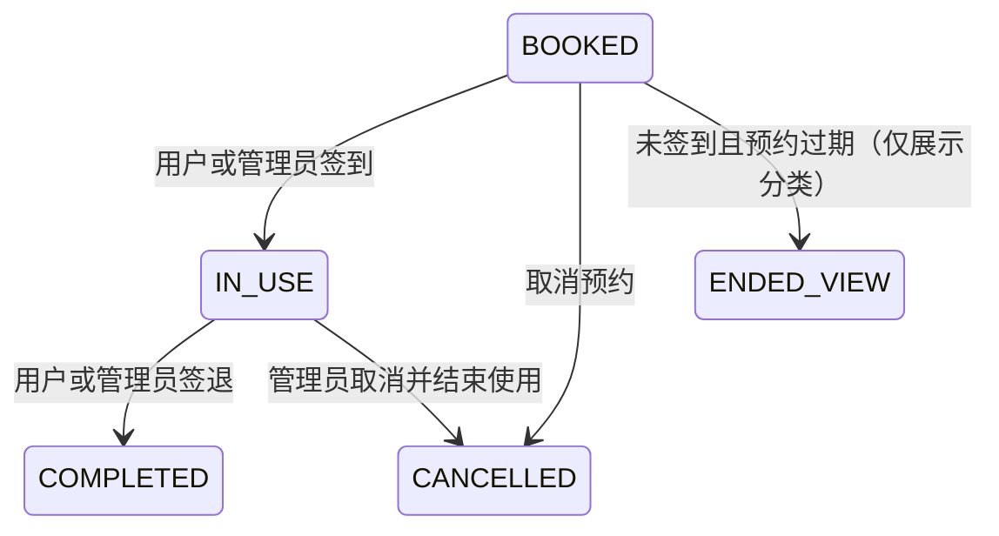

# 预约签到与签退技术设计

> 设备独立签到位置的最新设计见 `specs/device-checkin-location/design.md`；本文件中的 `settings/reservation.checkInSite` 仅作为旧数据兼容回退。

## 1. 设计目标

在不新增业务集合的前提下扩展现有 `reservations` 和 `settings/reservation`，将预约计划状态与实际使用状态统一在现有预约云函数中处理。所有状态变更、时间计算、身份校验和地理围栏判断均在云函数执行。

## 2. 模块边界

### 小程序

- `pages/mine/index`：展示签到/签退入口、操作状态及实际使用信息。
- `pages/admin/reservation-rules`：增加签到位置、半径、定位误差和提前签到时间配置。
- `pages/admin/reservations`：预约详情展示实际使用记录，并提供管理员异常代操作入口。
- `app.json`：声明 `scope.userLocation` 使用说明和 `getLocation` 隐私接口。

### 云函数

- `reservation`：新增普通用户签到、签退；统一有效预约状态和实际使用时长计算；管理员取消使用中预约时关闭实际使用记录。
- `admin`：扩展预约详情、筛选汇总、签到设置读写及管理员代签到/代签退。

## 3. 状态机



动态页面分类规则：

1. `CANCELLED` → 已取消。
2. `COMPLETED` → 已结束。
3. `IN_USE` → 使用中，即使预约计划结束时间已过也保持使用中，直至签退或管理员处理。
4. `BOOKED` 且 `endAt <= now` → 已结束、未签到。
5. 其他 `BOOKED` → 待使用。

## 4. 数据模型

### `reservations` 新增可选字段

```json
{
  "status": "BOOKED | IN_USE | COMPLETED | CANCELLED",
  "checkedInAt": 1787551200000,
  "checkedOutAt": 1787558400000,
  "actualDurationSeconds": 7200,
  "checkInSource": "USER_GEOFENCE | ADMIN_OVERRIDE",
  "checkOutSource": "USER | ADMIN_OVERRIDE | ADMIN_CANCEL",
  "checkInLocation": {
    "latitude": 39.123456,
    "longitude": 117.123456,
    "accuracy": 28,
    "distanceMeters": 36,
    "siteName": "主实验室"
  },
  "checkInByAdminId": "可选",
  "checkInOverrideReason": "可选",
  "checkOutByAdminId": "可选",
  "checkOutOverrideReason": "可选"
}
```

实际时长按 `checkedOutAt - checkedInAt` 计算为非负整数秒；页面按分钟或小时格式化，不使用客户端时钟。

### `settings/reservation` 新增字段

```json
{
  "checkInMode": "GEOFENCE",
  "checkInEarlyMinutes": 30,
  "checkInRadiusMeters": 100,
  "maxLocationAccuracyMeters": 150,
  "checkInSite": {
    "name": "主实验室",
    "latitude": 39.123456,
    "longitude": 117.123456
  }
}
```

位置未配置时 `checkInSite` 不包含有效经纬度，普通用户签到返回配置提示。

## 5. 地理围栏

- 客户端通过 `wx.getLocation({ type: 'gcj02' })` 获取经纬度和精度。
- 云函数校验经纬度范围、精度为有限非负数，且 `accuracy <= maxLocationAccuracyMeters`。
- 云函数使用 Haversine 公式计算当前位置到 `checkInSite` 的球面距离。
- 当 `distanceMeters <= checkInRadiusMeters` 时通过位置校验。
- 服务端保存有限精度坐标、定位误差和计算距离，用于管理审计。
- 预留 `verifyCheckInEvidence(mode, payload)`，后续可增加设备二维码校验而不改变状态机。

## 6. API 设计

### `reservation.checkIn`

请求：

```json
{
  "id": "预约ID",
  "location": { "latitude": 39.1, "longitude": 117.1, "accuracy": 25 }
}
```

事务内校验：预约属于当前用户、状态为 `BOOKED`、处于签到窗口、位置有效、设备没有其他 `IN_USE` 预约。成功后写入 `IN_USE`、服务器签到时间、来源和位置审计。

### `reservation.checkOut`

请求：`{ "id": "预约ID" }`。事务内校验预约属于当前用户且状态为 `IN_USE`，写入 `COMPLETED`、服务器签退时间和实际使用秒数。

### `admin.adminCheckIn` / `admin.adminCheckOut`

管理员请求包含预约 ID 和必填原因。代签到跳过地理围栏但保留时间窗口和单设备占用校验；代签退计算实际时长。所有操作写入管理员审计字段。

### 管理查询扩展

- `admin.reservationDetail` 返回实际使用和位置审计字段，不返回用户 `openid`。
- `admin.listReservations` 增加 `summary.checkedInCount`、`summary.completedCount`、`summary.actualDurationSeconds`。
- `admin.getReservationSettings` / `saveReservationSettings` 增加签到设置字段并继续保留未知配置字段。

## 7. 有效预约兼容调整

以下查询应把 `BOOKED` 和 `IN_USE` 都视为占用：

- 新建预约时间冲突
- 每日预约时长
- 用户有效预约数
- 设备可用时段
- 新建设备禁用时段
- 管理首页今日预约数

已完成和已取消记录不占用计划时段。处于 `IN_USE` 的记录始终占用设备签到权，直至签退或管理员处理。

## 8. UI 设计

### 视觉规范

- 方向：Industrial/utilitarian。
- 品牌绿：`#176B5B`。
- 使用中蓝：`#2563A6`。
- 危险红褐：`#B64A43`。
- 边界灰：`#E3E7E5`。
- 字体沿用小程序原生苹方，时长数字复用现有 Georgia 数字风格。

### 我的预约

- 待使用卡片底部右侧显示“签到”；未进入窗口时显示轻量提示。
- 使用中卡片增加签到时间和醒目的“签退”主按钮。
- 已结束卡片展示实际签到、签退和使用时长；未签到记录显示“未签到”。
- 操作按钮使用独立 loading 状态，避免重复提交。

### 管理页面

- 规则页增加“签到位置”区块，显示配置状态、位置名称、半径、最大误差和“使用当前位置设置”按钮。
- 预约详情增加“实际使用”区块；管理员代操作使用原因输入确认弹层。
- 预约列表标题区增加紧凑汇总：已签到次数、已完成次数、累计实际使用时长。

## 9. 安全、隐私与错误处理

- 使用 `cloud.getWXContext().OPENID` 获取可信调用者身份。
- 不接受客户端提交的签到/签退时间、距离、用户 ID 或状态。
- 不返回完整事件、上下文、环境变量或请求头。
- 普通用户不能读取实验室精确坐标；签到设置只对管理员返回。
- 定位拒绝、定位精度不足、超出范围、设备被占用分别返回明确业务错误。
- 小程序后台仍需完成位置隐私用途声明；本地配置不能替代平台侧隐私申报。

## 10. 测试策略

- 单元级：Haversine 距离、时间窗口、状态分类、实际时长格式化。
- 云函数最小验证：范围内签到、范围外拒绝、低精度拒绝、重复签到、重复签退、设备占用冲突。
- 页面验证：四个状态分类、定位拒绝提示、按钮 loading、管理详情与汇总。
- 回归：普通预约创建、取消、设备禁用时段和管理员取消仍正常。
